#  AI Proxy

基于 `springbootAI` Python 框架和 Vue 2 的 OpenAI 兼容代理控制台。页面参考 Rose API 的信息架构，提供登录、模型广场、控制台、API Key、用量、充值订单和管理员用户管理。

## 界面预览

以下截图覆盖公开入口、普通用户控制台和管理员页面。点击图片可以查看原图。

### 登录与注册

<table>
  <tr>
    <td width="50%"><b>登录</b><br><a href="./docs/screenshots/login.png">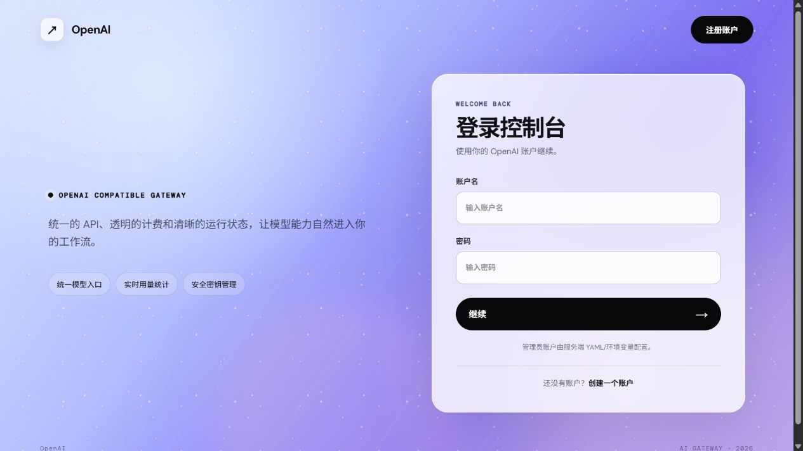</a></td>
    <td width="50%"><b>注册</b><br><a href="./docs/screenshots/register.png">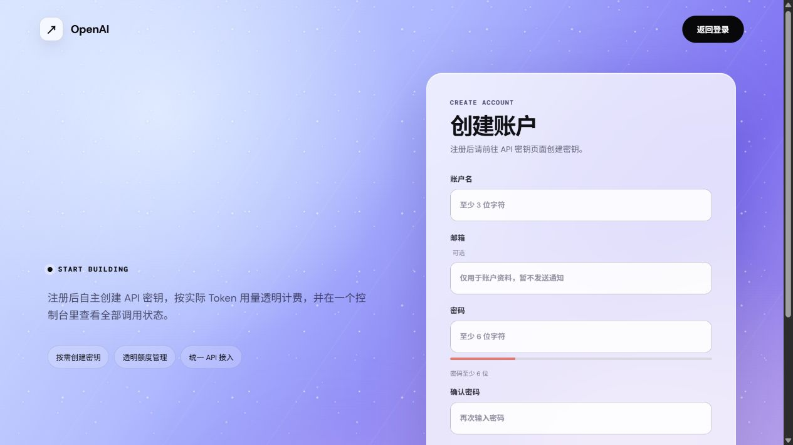</a></td>
  </tr>
</table>

### 用户控制台

<table>
  <tr>
    <td width="50%"><b>控制台</b><br><a href="./docs/screenshots/dashboard.png">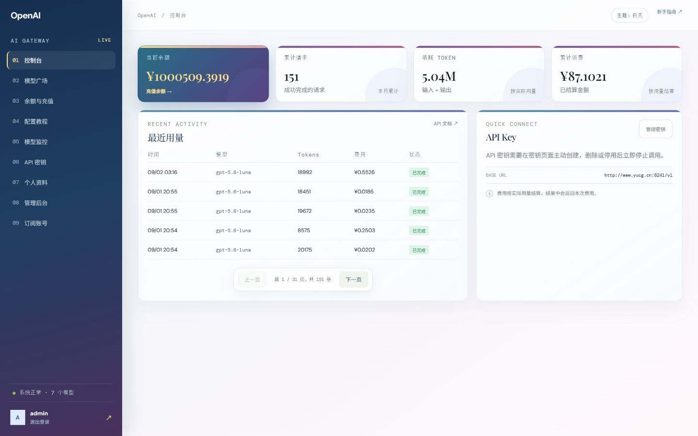</a></td>
    <td width="50%"><b>模型广场</b><br><a href="./docs/screenshots/models.png">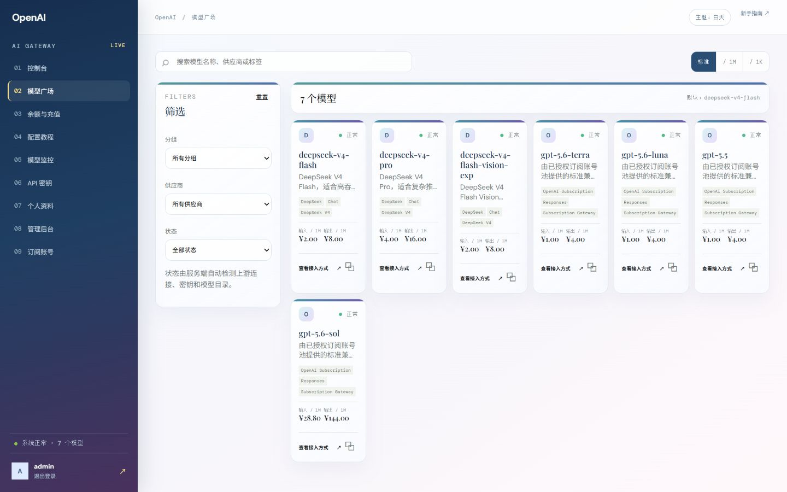</a></td>
  </tr>
  <tr>
    <td width="50%"><b>余额与充值</b><br><a href="./docs/screenshots/billing.png">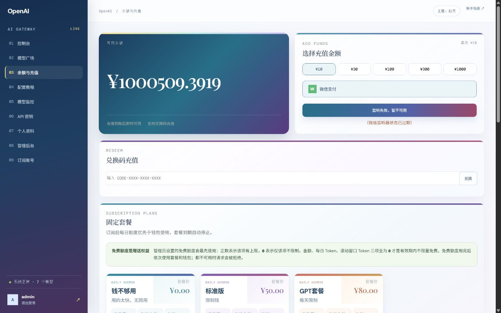</a></td>
    <td width="50%"><b>配置教程</b><br><a href="./docs/screenshots/docs.png">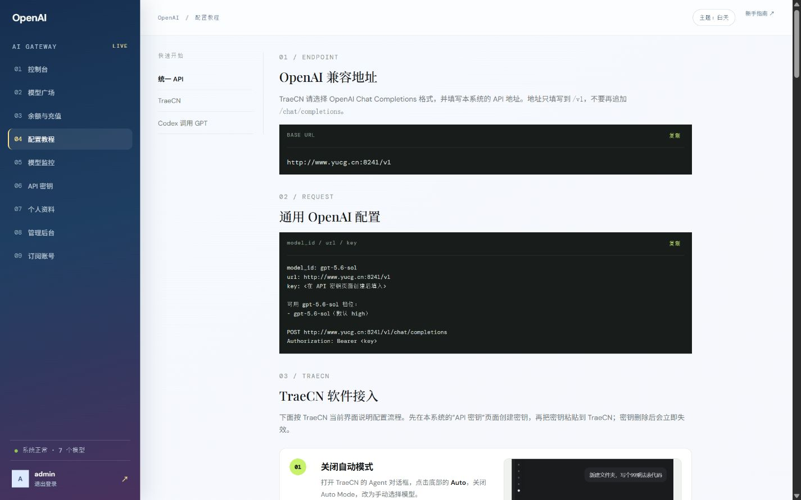</a></td>
  </tr>
  <tr>
    <td width="50%"><b>模型监控</b><br><a href="./docs/screenshots/monitoring.png">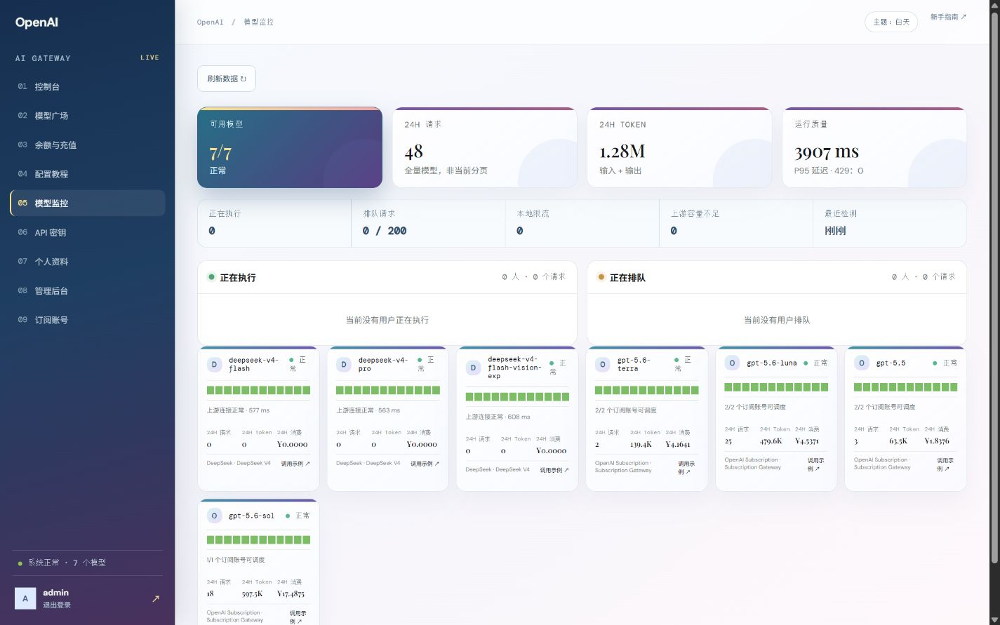</a></td>
    <td width="50%"><b>API 密钥</b><br><a href="./docs/screenshots/api-keys.png">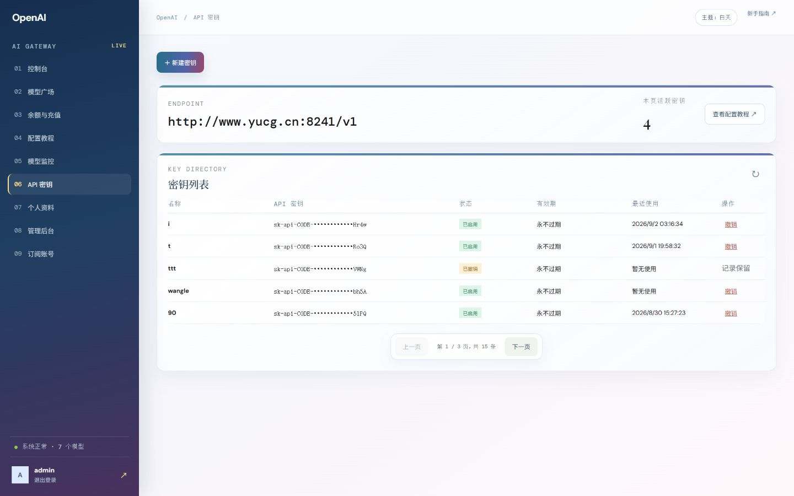</a></td>
  </tr>
  <tr>
    <td width="50%"><b>个人资料与登录设备</b><br><a href="./docs/screenshots/profile.png">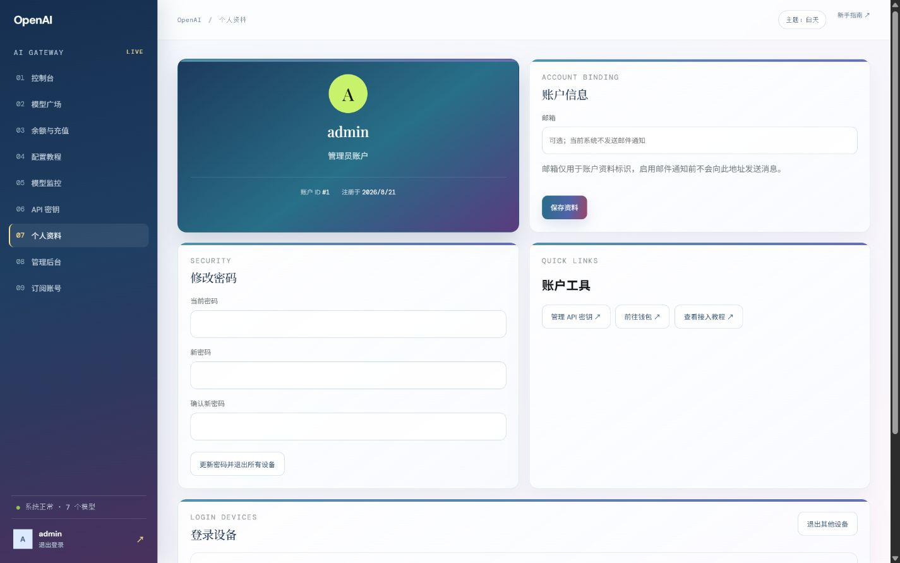</a></td>
    <td width="50%"></td>
  </tr>
</table>

### 管理后台

<table>
  <tr>
    <td width="50%"><b>业务管理</b><br><a href="./docs/screenshots/admin.png">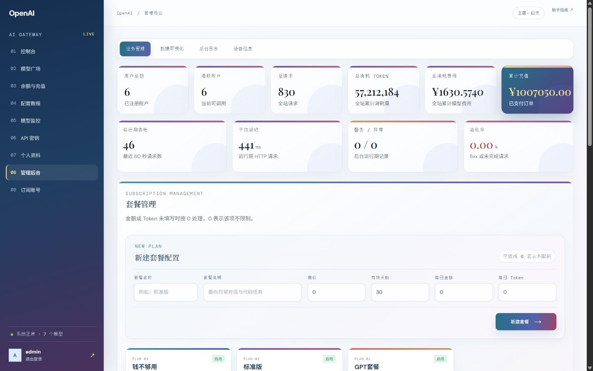</a></td>
    <td width="50%"><b>订阅账号池</b><br><a href="./docs/screenshots/subscription-accounts.png">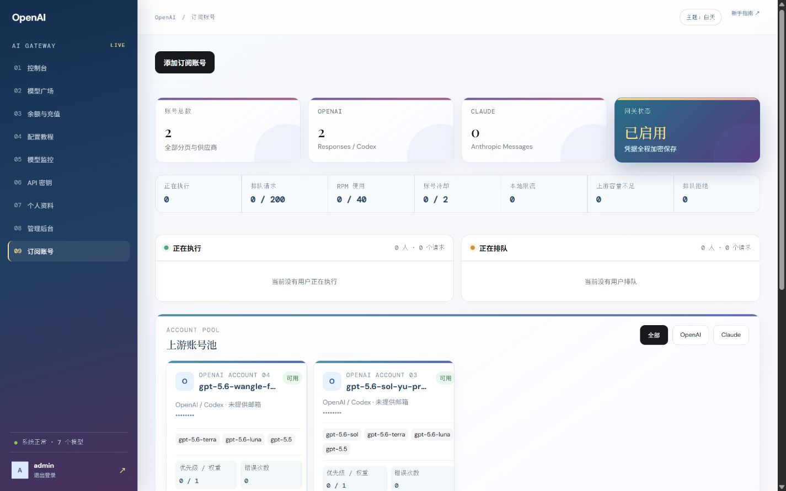</a></td>
  </tr>
  <tr>
    <td width="50%"><b>用户详情</b><br><a href="./docs/screenshots/admin-user-detail.png">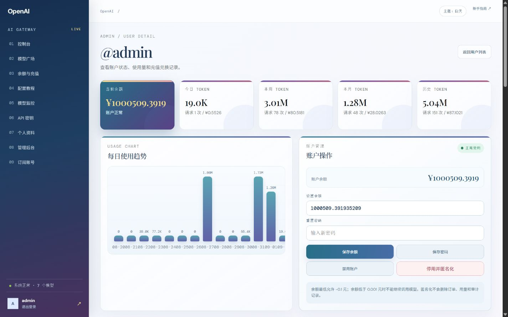</a></td>
    <td width="50%"></td>
  </tr>
</table>

## 快速启动

```powershell
python -m pip install -r requirements.txt
Copy-Item application.example.yml application.yml
$env:ROSE_JWT_SECRET = '请替换为至少32位随机字符串'
$env:ROSE_ADMIN_PASSWORD = '请替换为管理员密码'
$env:ROSE_SUBSCRIPTION_CREDENTIAL_SECRET = '请替换为至少32位随机字符串'
# 按需设置 ROSE_OPENAI_API_KEY / DEEPSEEK_API_KEY
python app.py
```

`application.yml`、数据库、日志和 FRP 文件均为本机运行数据，不会提交到 Git；可提交的配置模板是 `application.example.yml`。生产环境必须通过环境变量提供密钥，不要把真实 Token 写回模板。

后端入口使用 `@SpringBootApplication(scan_base_packages=["backend"])`，业务模块由
SpringBootAI 扫描并通过 `@Repository`、`@Service`、`@RestController`、
`@Configuration`、`@Bean`、`@ControllerAdvice`、`@Component` 和 `@Autowired`
装配。也可以使用 `python -m uvicorn app:app --host 0.0.0.0 --port 8241` 启动。

OpenAI 兼容的 Chat Completions 和 Responses 请求使用原生异步上游连接：GPT、DeepSeek
和其他 `rose.models` 条目都会通过 `httpx.AsyncClient` 读取 SSE，不为每个请求创建进程，
也不再使用线程池等待上游。同步 `invoke` 方法仅保留给后台兼容调用；前端 API 路由使用
`ainvoke_with_trace` / `astream_with_trace`。因此同一进程可以并发保持多条模型流连接；需要
多进程扩展时只在 MySQL 部署使用多个 Uvicorn worker，SQLite 仍建议单 worker。

控制台、文件、业务代码和第三方库日志统一由 SpringBootAI 的日志组件输出，格式为
`时间 | 级别 | logger | 文件:函数:行 | 消息`。HTTP 访问记录来自全局
`RequestContextInterceptor`，包括 method、path、status、duration 和 request_id；Uvicorn
默认 access log 已关闭，避免出现另一套 `INFO: 127.0.0.1 ...` 格式。若使用 CLI 启动，
建议使用 `python -m uvicorn app:app --no-access-log`，不要传入自定义 Uvicorn log config。

上游连接池按模型和事件循环复用 TCP/TLS 连接，普通请求与流式请求都不会在每次调用时
重新创建 `AsyncClient`。默认最多 100 条并发连接、保留 20 条 keep-alive 连接，连接建立
超时 10 秒；可在 `rose.proxy.transport` 中调整。`http2` 默认关闭（安装 `h2` 后可开启），
未安装 `h2` 时会自动回退 HTTP/1.1。连接失败、429 和 5xx 最多按 YAML 重试，流式已经
向客户端输出内容后不会重放，避免重复计费或重复上传图片。
余额校验、扣费和统计写入放到后台线程执行，不占用 ASGI 事件循环；它们不会阻塞上游
连接建立或首个 SSE 数据片段。

后端按 SpringBootAI 推荐的分层目录组织：

```text
backend/
  common/       # Result 辅助、全局异常 Advice、公共上下文
  config/       # @Configuration / @Bean / @Value 配置 Bean
  controller/   # @RestController 业务 API
  interceptor/  # @Component + HandlerInterceptor 请求链路
  mappers/      # @Mapper 接口与 XML SQL（唯一业务 SQL 边界）
  repository/   # @Repository 事务编排、分页和实体转换
  service/      # @Service 业务服务
```

普通 JSON API 统一由 SpringBootAI 注解控制器返回 `Result`；OpenAI Chat/
Responses、微信/支付宝通知和二维码仍由 `app.py` 挂载原始协议适配器，确保
SSE、表单、签名校验和二进制响应不被 JSON 包装破坏。

数据库初始化和兼容升级只在 Repository 的 `@PostConstruct` 中执行；用户、订单、兑换码、用量和统计的业务 SQL 全部位于 `backend/mappers/StoreMapper.xml`，业务控制器和服务不直接打开 SQLite 连接，也不拼接 SQL。

默认已关闭 SpringBootAI ORM 的启发式 `sql_injection_detection`，因为模型工具定义和
用户提示词中可能出现 `SELECT`、`UPDATE` 等普通文本，容易被误判并阻断会话记录。
数据库操作仍只使用 Mapper XML 的参数绑定，不接受运行时 SQL 拼接。可通过
`ROSE_SQL_INJECTION_DETECTION=true` 临时重新开启检测。

## 隐私与调用记录

代理仍支持 Chat Completions 的 `image_url` 和 Responses 的
`input_image`/`input_text`，多模态内容会直接转发给上游模型，但不会被本系统保存。
调用记录只包含用户、请求 ID、协议、模型、状态、开始/完成时间、延迟、prompt
tokens、completion tokens、total tokens 和费用，供计费、统计和管理员图表使用。

`conversation_records` 中的 `request_json`、`messages_json`、`response_json`、
`answer_text` 等旧字段仅为兼容已有 SQLite/MySQL 表结构，服务启动时会清空，之后始终
写入 `{}`、`[]`、`NULL` 和空字符串。`conversation_assets` 旧表也会在启动时清空，
不会再保存图片文件或图片元数据。上游转发不会因为关闭记录而增加图片处理延迟。

相关配置（默认不可保存内容）：

```yaml
rose:
  conversation:
    enabled: true
    store-content: false
    store-media: false
    retention-days: 0
```

如需删除旧版本已经落盘的图片，可在停止服务后人工删除 `data/conversation-assets`；
这只影响历史残留文件，不影响图片向上游模型转发。

另开终端启动 Vue 2 前端：

```powershell
cd frontend
npm install
npm run dev
```

打开 http://localhost:8240/，全新数据库的默认管理员是 `admin / admin`。生产环境请务必通过 `ROSE_ADMIN_USERNAME` 和 `ROSE_ADMIN_PASSWORD` 覆盖，参考站点的 `yuconggen` 账号不会写入本系统。

生产环境可以直接使用 `frontend/dist`，或使用 Nginx 将 `/api` 和 `/v1` 反向代理到 8241。

管理员可在管理后台的“系统配置”中直接查看和修改服务器 `application.yml`。服务端只允许操作项目固定配置文件，保存前会校验 YAML 和文件版本，采用原子替换并生成 `application.yml.bak`；普通用户无法访问该接口。通过 `restart_backend.sh` 管理、且 `.run/backend.pid` 与当前进程一致时，页面还可安全安排后端重启。可用 `rose.admin-config.enabled` 关闭此功能，并通过 `ROSE_APPLICATION_CONFIG_FILE`、`ROSE_BACKEND_RESTART_SCRIPT` 由服务器环境覆盖固定文件位置。

注册页提供账户名、邮箱、密码确认、强度提示和服务条款勾选；账户名只允许字母、数字、下划线、中划线和点，管理员账号不会通过公开注册生成。

## Claude / OpenAI 订阅网关

管理员登录后可在“订阅账号”页面接入自己有权使用的 Claude 或 OpenAI 订阅账号。推荐使用页面生成的 PKCE OAuth 链接，也可导入已授权的 Access Token / Refresh Token。OAuth state 会绑定当前管理员和供应商，Token 只以 Fernet 密文写入 `upstream_subscription_accounts`，管理 API 和页面不会回传明文。

Codex 订阅请求、模型查询和 OAuth 使用统一的版本兼容标识，默认 `0.153.2`（对齐开发机已安装的 CLI，并非声明这是官方最低版本）。可通过 `rose.subscription-gateway.codex-client-version` 或 `ROSE_CODEX_CLIENT_VERSION` 调整；未设置的新旧配置均使用默认值，无须覆盖部署环境的 `application.yml`。仅在启动时读取，不增加转发过程中的探测、子进程或等待。

调用 `gpt-6-astra` 时，订阅账号和用户分组都须允许该模型，客户端也应更新 Codex。推荐使用 `/v1/responses` 并传入 `"model": "gpt-6-astra"`、`"reasoning": {"effort": "low"}`（或该模型支持的其他强度）。更新网关版本标识不等于给账号增加模型权限，也不能替代客户端对新协议的支持。网关保留 Responses 的工具、推理和流式事件字段；不要把“流在 response.completed 前断开”单独当成模型版本错误，仍需查看实际上游错误。

2026-09-05 在部署服务器上对同一已授权账号实测：旧标识 `0.146.0` 返回 HTTP 400，提示 Astra 需要新版 Codex；`0.153.2` 返回 HTTP 200，并收到 `response.completed`。这是该环境的兼容性验证，不代表所有账号均拥有 Astra 权限。

生产启动前必须设置独立且稳定的加密密钥；修改该值后，已经保存的凭据需要重新授权：

```powershell
$env:ROSE_SUBSCRIPTION_CREDENTIAL_SECRET = '<至少 32 位的随机值>'
python app.py
```

主要配置位于 `rose.subscription-gateway`，可以控制总开关、OAuth/请求超时、连接池和单次请求尝试的账号数。账号池由 SpringBootAI 管理的平滑加权轮询服务调度：优先选择最高优先级，同优先级按权重轮询；带会话粘连键的请求优先沿用原健康账号。账号支持模型白名单、可配置冷却与自动 Token 刷新；401/403 始终会将凭据标记为失效。默认关闭临时冷却，429/网络错误仍会记录并在当前请求内切换池内下一个账号，但不会阻止后续请求再次调度该账号。

OpenAI 订阅上游有时会以 HTTP 200 的 SSE `response.failed` 返回“Selected model is at capacity”。网关会在任何正文、推理增量或工具参数尚未发给客户端时自动退避重试；一旦已经输出语义内容则绝不重放，避免重复回答或重复执行工具。默认重试 2 次、退避 1 秒，可用 `ROSE_SUBSCRIPTION_CAPACITY_RETRIES` 和 `ROSE_SUBSCRIPTION_CAPACITY_RETRY_BASE_SECONDS` 调整。重试耗尽时返回 `503 upstream_capacity`，并带 `Retry-After` 和 `X-Rose-Error-Source: upstream_capacity`。

订阅网关默认启用 `trust-env`：Windows/macOS 会读取操作系统代理，Linux 会读取 `HTTP_PROXY`、`HTTPS_PROXY` 和 `NO_PROXY`。如果部署环境可以直接访问上游，可设置 `ROSE_SUBSCRIPTION_TRUST_ENV=false` 强制直连。

网关默认对每个上游账号限制为 1 个并发请求、每分钟 20 个请求；账号繁忙时请求会一直排队等待，不产生本地排队超时。OpenAI 请求可使用稳定的 `prompt_cache_key`，Claude 请求可使用 `metadata.user_id`，网关只保存其本地 SHA-256 哈希并在一小时内把同一会话粘连到同一健康账号；提示词和会话标识明文不会写入该缓存。这些是确定性的流量保护和会话连续性措施，不会伪造浏览器 Cookie、随机鼠标/键盘行为或人为请求节奏，也不能保证上游不会限制账号。具体上限可通过以下环境变量调整：

```powershell
$env:ROSE_SUBSCRIPTION_ACCOUNT_CONCURRENCY = '1'
$env:ROSE_SUBSCRIPTION_ACCOUNT_RPM = '20'
$env:ROSE_SUBSCRIPTION_ACCOUNT_COOLDOWN_ENABLED = 'false'
$env:ROSE_SUBSCRIPTION_QUEUE_TIMEOUT_SECONDS = '0'
$env:ROSE_SUBSCRIPTION_SESSION_AFFINITY_TTL_SECONDS = '3600'
```

`ROSE_SUBSCRIPTION_QUEUE_TIMEOUT_SECONDS=0` 表示一直等待账号槽位，也是默认设置，适合只有一个订阅账号、请求以 Codex 长任务为主的个人部署。设置为正数后，超过该等待时间会返回 `503 local_queue_timeout`、`Retry-After` 和 `X-Rose-Error-Source: local_queue`；只有实际达到本地 RPM 上限或上游明确返回 429 时才会返回 429。不要为了消除排队而盲目提高单账号并发数。

无限等待并不等于无限堆积：`ROSE_SUBSCRIPTION_MAX_QUEUED_REQUESTS` 默认限制为 200。超过队列上限返回 `429 local_queue_full`。本地 API Key 失败会返回 `X-Rose-Error-Source: local_auth`，本地余额失败返回 `local_billing`，便于与上游 401/429 明确区分。

用户并发排队会监听客户端断线：取消或断开后自动移出等待队列，正在处理的请求取消后释放对应用户名额；上游首段内容到达前取消也会关闭已打开的连接。正常连接仍按原有规则等待，不新增总时限、不提高并发上限。监听使用 ASGI 断线事件，不轮询数据库、不额外复制请求体，也不缓冲正常 SSE。

对外调用继续使用本系统创建的 API Key，不要把上游订阅 Token 交给客户端：

```powershell
# OpenAI / Codex subscription（Chat Completions，后端自动转 Responses）
curl.exe http://localhost:8241/v1/chat/completions `
  -H "Authorization: Bearer sk-api-CODE..." `
  -H "Content-Type: application/json" `
  -d '{"model":"gpt-5.4","messages":[{"role":"user","content":"hello"}],"stream":true,"prompt_cache_key":"chat-001","stream_options":{"include_usage":true}}'

# OpenAI / Codex subscription（原生 Responses API）
curl.exe http://localhost:8241/v1/responses `
  -H "Authorization: Bearer sk-api-CODE..." `
  -H "Content-Type: application/json" `
  -d '{"model":"gpt-5.4","input":"hello","stream":true,"prompt_cache_key":"chat-001"}'

# Claude subscription（Anthropic Messages API）
curl.exe http://localhost:8241/v1/messages `
  -H "x-api-key: sk-api-CODE..." `
  -H "anthropic-version: 2023-06-01" `
  -H "Content-Type: application/json" `
  -d '{"model":"claude-sonnet-4-6","max_tokens":256,"metadata":{"user_id":"chat-001"},"messages":[{"role":"user","content":"hello"}]}'

# Claude subscription（统一 OpenAI Chat Completions 路由）
curl.exe http://localhost:8241/v1/chat/completions `
  -H "Authorization: Bearer sk-api-CODE..." `
  -H "Content-Type: application/json" `
  -d '{"model":"claude-sonnet-4-6","messages":[{"role":"user","content":"hello"}],"stream":false,"prompt_cache_key":"chat-001"}'
```

OpenAI 与 Grok 订阅账号接管命中账号模型白名单的 `/v1/responses` 和 `/v1/chat/completions` 请求。Claude 订阅账号同时提供统一的 `/v1/chat/completions`、原生 `/v1/messages` 与 `/v1/messages/count_tokens`。Kimi Coding、智谱 GLM Coding 和 MiniMax Coding 使用官方 API Key 接入 `/v1/chat/completions`。Chat Completions 的消息、多模态内容、函数工具、普通 JSON 响应和流式 SSE 会进入统一的排队、会话粘滞、计费与失败处理；未命中任何订阅池的模型仍走 `application.yml` 中已有的普通模型上游。

### Trae 使用 OpenAI 订阅模型

- API 格式选择 **OpenAI Chat Completions**。关闭“完整 URL”时填写 `http://www.yucg.cn:8241/v1`；打开时必须填写 `http://www.yucg.cn:8241/v1/chat/completions`，不能只填 `/v1`。
- 模型 ID 填写账号池和用户分组均允许的模型，例如 `gpt-6-astra`；密钥使用本系统生成的 API Key。
- 仅在 OpenAI 订阅的 Chat Completions 兼容层，接受并校验客户端输出长度参数，但不向 Codex 上游发送 `max_tokens`、`max_completion_tokens`、`max_output_tokens`；同时过滤上游不支持的采样默认值及 `metadata`、`safety_identifier`、`truncation`，避免 `Unsupported parameter`。**此路径不能保证客户端指定的输出 Token 上限**，现有余额、额度和计费逻辑不变。
- 消息、工具调用、推理强度、会话缓存键及流式/非流式响应保留。此兼容处理不应用于 Codex 原生 `/v1/responses`、Claude 订阅或普通 API 上游，也不会增加网络探测和重试。
- 两个 OpenAI 订阅入口共用网关的 Codex 兼容请求头，不透传下游客户端的 `User-Agent`、`Originator`、自定义请求头、Cookie 或网关 API Key；上游认证仍使用订阅账号凭据。这只是协议兼容和凭据隔离，并不保证来源不可辨识或免除上游使用限制，消息内容、工具定义及行为仍可能体现客户端差异。

### GPT 请求的默认推理强度

在 `application.yml` 中设置（**修改后重启后端生效**，前端无需重启）：

```yaml
rose:
  proxy:
    default-gpt-reasoning-effort: high
```

例如改为 `medium` 可调整全局缺省档位。配置启动时读取，不在每次请求时读取文件。配置值必须是有效的正向推理档位，通常可选 `low`、`medium`、`high`、`xhigh`、`max`。

- GPT-5 系列推理模型（含 Sol、Terra、Luna、Codex）和 `gpt-6-astra` 在请求未指定强度、值为 `null`、空字符串、`none`、非字符串或未知档位时，由网关使用上述配置（默认 **`high`**）。普通 API 上游按实际上游模型名判断；非 GPT、GPT-4/4o、`chat-latest` 及图像/音频模型不自动添加。
- 此规则同时适用于 Chat Completions 和 Responses，流式与非流式一致。Chat 使用 `reasoning_effort`，订阅 Responses 上游实际发送 `reasoning: {effort: "high"}`；后台执行/账号池排队记录读取这份转发参数，显示“高”，不是只修改显示文字。用户组排队尚未解析请求时，不虚构模型或档位。
- 调用方明确指定的 `minimal`、`low`、`medium`、`high`、`xhigh`、`max` 会规范为小写后保留；本站策略将 `none` 视为没有有效推理强度，将 `ultra` 等非 OpenAI API 档位视为未知值，二者都回退到 YAML 默认值。嵌套 `reasoning.effort` 优先于 `reasoning_effort` 和兼容别名 `reasoning-effort`，`summary` 等其他推理字段保留。普通 API 的 GPT 默认值也使用这项配置；非 GPT 仍保留各模型配置的默认强度。
- 这是本项目的默认策略，不代表上游原生默认值。只在转发前处理请求字段，不增加网络探测、数据库查询或 SSE 缓冲；更高推理强度本身可能增加上游生成耗时和 Token 使用量。

## 部署前清空数据（不可恢复）

如果要将当前项目作为全新实例部署，请先停止后端和前端服务，再清理配置的 SQLite 数据库。该操作会删除所有用户、API Key、订单、兑换码、套餐订阅、免费额度、Token 用量、会话记录和后台日志；不会删除 `application.yml`、二维码图片、前端代码或模型配置。删除前请确认没有待处理的支付订单，并按需备份数据库。

数据库路径优先读取环境变量 `ROSE_DB_PATH`，未设置时使用 `./data/rose.db`。必须同时删除 SQLite 的 `-wal` 和 `-shm` 文件，否则旧事务可能在下次启动时恢复。不要在服务运行时删除数据库文件。

### Windows PowerShell

在项目根目录执行：

```powershell
# 1. 先停止 python app.py、uvicorn 和前端 dev server
# 2. 解析与 application.yml 相同的数据库路径
$dbPath = if ([string]::IsNullOrWhiteSpace($env:ROSE_DB_PATH)) {
  [IO.Path]::GetFullPath((Join-Path (Get-Location) 'data\rose.db'))
} else {
  [IO.Path]::GetFullPath($env:ROSE_DB_PATH)
}

Write-Host "即将清理：$dbPath"
$confirm = Read-Host '输入 DELETE_CONFIRM 继续'
if ($confirm -ne 'DELETE_CONFIRM') { throw '已取消，未删除任何数据' }

@($dbPath, "$dbPath-wal", "$dbPath-shm") |
  Where-Object { Test-Path -LiteralPath $_ } |
  ForEach-Object { Remove-Item -LiteralPath $_ -Force }

Write-Host 'SQLite 业务数据已清空。现在可以重新启动后端。'
```

### Linux / macOS

在项目根目录执行：

```bash
# 1. 先停止后端和前端服务
DB_PATH="${ROSE_DB_PATH:-./data/rose.db}"
printf '即将清理：%s\n输入 DELETE_CONFIRM 继续：' "$DB_PATH"
read -r CONFIRM
[ "$CONFIRM" = "DELETE_CONFIRM" ] || { echo "已取消，未删除任何数据"; exit 1; }
rm -f -- "$DB_PATH" "$DB_PATH-wal" "$DB_PATH-shm"
echo 'SQLite 业务数据已清空。现在可以重新启动后端。'
```

重新启动后，`StoreRepository` 会自动创建表结构和索引；全新 SQLite/MySQL 数据库
都会写入初始管理员 `admin/admin`，`rose.bootstrap` 中配置的管理员账号也会在不存在时重新创建。
已有账户不会被初始化脚本覆盖。数据库之外的 CSV、JSONL、备份文件不会自动删除，请在确认内容后单独清理。

## 配置

所有核心参数集中在 [application.yml](./application.yml)：

- `springbootai.ai.openai.api-key`：上游 OpenAI 或兼容网关密钥。
- `springbootai.ai.openai.base-url`：默认 `https://api.openai.com/v1`。
- `rose.proxy.default-model`：默认 `gpt-5.6-sol`。
- `rose.proxy.transport.max-connections` / `max-keepalive-connections`：上游连接池并发和保活上限。
- `rose.proxy.transport.keepalive-expiry-seconds`：空闲连接保留时间，默认 60 秒。
- `rose.proxy.transport.connect-timeout-seconds`：TCP/TLS 建连超时，默认 10 秒。
- `rose.proxy.transport.pool-timeout-seconds`：连接池繁忙时等待可用连接的超时，默认 30 秒。
- `rose.proxy.transport.http2`：是否启用 HTTP/2（需 `pip install "httpx[http2]"`）。
- `rose.proxy.transport.max-retries` / `retry-delay-ms`：连接失败、429、5xx 的有限重试参数。
- 传输参数也可在单个 `rose.models[]` 条目中使用同名字段覆盖，便于按供应商单独调优。
- `rose.billing.price-multiplier`：默认 `1.0`，按上游原始 token 数计费。
- `rose.payment.wechat` / `rose.payment.alipay`：微信支付和支付宝商户配置。
- `rose.payment.demo-mode`：开发环境默认为 `true`，创建充值订单后可模拟到账；接入真实商户签名、证书和回调后改为 `false`。
- `rose.bootstrap.admin-username` / `rose.bootstrap.admin-password`：本系统首次启动管理员；默认账号密码为 `admin/admin`，生产环境请立即通过环境变量修改。
- `jwt.secret_key` / `jwt.expires_in`：SpringBootAI 框架 JWT 配置；生产环境通过 `ROSE_JWT_SECRET` 提供长度至少 32 的随机密钥。
- `logging.log_dir`：SpringBootAI 统一日志目录，默认 `./log`；按日期生成 `application_YYYY-MM-DD.log` 和 `error_YYYY-MM-DD.log`，可用 `LOG_DIR` 覆盖。

### 任意第三方模型

`rose.models` 是独立的模型目录，每个条目都可以指向不同的 OpenAI 兼容网关。只要供应商提供 `/chat/completions` 接口，就不需要修改 Python 代码：

默认配置已将 DeepSeek 模型注释停用，使用 `rose.models: []`，仅保留订阅账号池提供的模型；原条目保留在 YAML 注释中，需要恢复时可取消注释并配置密钥（全部恢复时把 `models: []` 改回 `models:`）。这与账号池新增的 Grok、Kimi Coding、GLM Coding 和 MiniMax Coding 支持相互独立。显式空列表不会再生成普通 API 默认模型；省略此配置项仍兼容旧版默认模型配置。

```yaml
rose:
  proxy:
    default-model: gpt-5.6-sol
  models:
    - id: deepseek-chat
      enabled: true
      provider: DeepSeek
      endpoint: Chat
      group: Reasoning
      upstream-model: deepseek-chat
      base-url: https://api.deepseek.com/v1
      api-key: ${DEEPSEEK_API_KEY:}
      temperature: 0.7
      timeout-seconds: 180
      demo-mode-when-key-missing: false
      currency: CNY
      pricing:
        input-cny-per-million: 2
        output-cny-per-million: 8
        cache-cny-per-million: 2
        multiplier: 1.0
      description: DeepSeek OpenAI 兼容模型。
```

每个模型都支持独立的上游地址、密钥、上游模型名、超时、演示模式和输入/输出价格。所有用户余额和扣费均按人民币计算；如果某个 CNY 模型只填写 USD 价格，系统会按 `usd-to-cny` 自动换算。请求中的 `model` 对应 `id`，未传时使用 `rose.proxy.default-model`；模型目录会同步出现在模型广场、计费计划和 `/api/models`。

模型广场和模型监控会合并 `rose.models` 与订阅账号池的模型目录。YAML 模型按 `rose.proxy.health-check` 定时请求上游 `/models`，订阅模型则显示账号池当前的可用、冷却或失效状态。

### Trae 导入 DeepSeek

如果 Trae 直接连接 DeepSeek，请填写：

```text
Base URL: https://api.deepseek.com/v1
API Key: DeepSeek 官方 API Key（sk-...）
Model: deepseek-v4-flash、deepseek-v4-pro 或 deepseek-v4-flash-vision-exp
```

如果 Trae 通过本项目代理，请填写：

```text
Base URL: http://127.0.0.1:8241/v1
API Key: 在本系统“API 密钥”页面创建的用户密钥（sk-api-CODE-...）
Model: application.yml 中 `rose.models` 的 `id`
```

两种方式只能选一种：官方 `sk-...` 不要填到本系统的用户密钥位置，代理密钥也不能直接发往
`api.deepseek.com`。DeepSeek 返回 `400 Bad Request` 时，优先检查请求体；特别是
`stream_options` 只能和 `stream: true` 一起发送，非流式请求应删除该字段。模型名称也必须和
DeepSeek `/v1/models` 返回的 ID 完全一致。通过本项目代理时，错误响应会保留上游的
`message`、`code` 和 `param`，方便直接定位具体字段。

### 微信支付（Native）

生产环境将 `rose.payment.demo-mode` 设为 `false`，并配置：`WECHAT_PAY_ENABLED=true`、`WECHAT_APP_ID`、`WECHAT_MCH_ID`、`WECHAT_API_V3_KEY`（32 字节）、`WECHAT_PRIVATE_KEY_PATH`（商户 RSA 私钥）、`WECHAT_CERT_SERIAL_NO`（商户证书序列号）、`WECHAT_PLATFORM_CERT_PATH`（微信平台证书）、`WECHAT_PLATFORM_CERT_SERIAL_NO`（平台证书序列号）。`PAYMENT_NOTIFY_BASE_URL` 必须是公网 HTTPS 地址，微信回调为 `/api/payment/wechat/notify`。

### 支付宝（RSA2 当面付）

配置 `ALIPAY_ENABLED=true`、`ALIPAY_APP_ID`、`ALIPAY_PRIVATE_KEY_PATH`（应用 RSA2 私钥）和 `ALIPAY_PUBLIC_KEY`（支付宝公钥，可直接填 PEM 或证书正文）。可选 `ALIPAY_SELLER_ID`，网关默认 `https://openapi.alipay.com/gateway.do`。公网回调为 `/api/payment/alipay/notify`，必须使用 HTTPS 并在支付宝开放平台配置白名单。

支付回调会验签、核对订单渠道和金额，并且只入账一次。没有真实商户证书时请保持 demo 模式，live 模式不会允许前端模拟到账。

默认使用 SQLite 文件 `./data/rose.db`，也支持 SpringBootAI MyBatis 的 MySQL 模式。API Key 同时支持 `Authorization: Bearer <JWT>` 和 OpenAI 常用的 `Authorization: Bearer sk-api-CODE-...`。

## 全新切换到 MySQL（不迁移旧数据）

当前版本可以使用 MySQL 作为全新数据源。MySQL 模式会在启动时执行
`backend/resources/schema_mysql.sql` 创建表和索引，不会读取、复制或迁移
`data/rose.db` 中的旧数据。请先停止后端，再按下面顺序操作；不要只把
`driver` 改成 `mysql` 而跳过数据库创建和依赖安装。

注意：Docker 里常见的默认数据库名 `springpy` 可能属于 SpringBootAI
示例或其他项目，虽然也有 `users` 表，但字段结构不同，不能直接复用。本项目
启动时会校验 `users` 表；检测到不兼容结构会明确报错，不会自动修改或删除该库。
请为本项目创建独立数据库，例如 `rose_proxy`。

### 1. 创建空数据库和账号

在 MySQL 客户端执行（名称和密码按部署环境替换）：

```sql
CREATE DATABASE rose_proxy CHARACTER SET utf8mb4 COLLATE utf8mb4_unicode_ci;
CREATE USER 'rose_proxy'@'%' IDENTIFIED BY '替换为强密码';
GRANT ALL PRIVILEGES ON rose_proxy.* TO 'rose_proxy'@'%';
FLUSH PRIVILEGES;
```

Docker 中可先执行 `docker ps` 找到 MySQL 容器，再运行：

```powershell
docker exec -it <mysql容器名> mysql -uroot -p
```

### 2. 安装 MySQL 驱动

在项目根目录执行：

```powershell
python -m pip install -r requirements.txt
```

其中 `requirements.txt` 已包含 `pymysql`。如果只想补装驱动，可执行
`python -m pip install pymysql`。

### 3. 设置连接配置

推荐用环境变量覆盖 `application.yml`，避免把数据库密码写入文件。PowerShell
当前窗口示例：

```powershell
Remove-Item Env:ROSE_DB_PATH -ErrorAction SilentlyContinue
$env:DB_DRIVER = 'mysql'
$env:DB_HOST = '127.0.0.1'
$env:DB_PORT = '3306'
$env:DB_NAME = 'rose_proxy'
$env:DB_USERNAME = 'rose_proxy'
$env:DB_PASSWORD = '替换为强密码'
python app.py
```

也可以直接在 `application.yml` 的 `database` 段填写 `driver: mysql`、
`database: rose_proxy`、`host`、`port`、`username` 和 `password`。MySQL 模式下
`database` 表示 MySQL 数据库名，不是 SQLite 文件路径。SpringBootAI 使用的环境
变量名称是 `DB_DRIVER`、`DB_HOST`、`DB_PORT`、`DB_NAME`、`DB_USERNAME`、
`DB_PASSWORD`。

直接写入 YAML 的最小配置如下（生产环境更推荐使用环境变量）：

```yaml
database:
  enabled: true
  orm: mybatis
  driver: mysql
  host: 127.0.0.1
  port: 3306
  database: rose_proxy
  username: rose_proxy
  password: "替换为强密码"
  charset: utf8mb4
  mapper_locations:
    - backend/mappers/StoreMapper.xml
```

### 4. 启动和检查

首次启动会自动创建 MySQL 表，管理员账号按 `rose.bootstrap` 配置创建。检查
`log/application_YYYY-MM-DD.log` 中没有连接错误后，再登录前端注册用户和创建
API Key。旧的 `data/rose.db`、`rose.db-wal`、`rose.db-shm` 不会被 MySQL 模式读取，
确认切换成功后才可按“部署前清空数据”章节删除它们。

切回 SQLite 时停止服务并执行：

```powershell
$env:DB_DRIVER = 'sqlite'
Remove-Item Env:DB_NAME -ErrorAction SilentlyContinue
Remove-Item Env:DB_USERNAME -ErrorAction SilentlyContinue
Remove-Item Env:DB_PASSWORD -ErrorAction SilentlyContinue
python app.py
```

MySQL 模式仍由 `backend/mappers/StoreMapper.xml` 执行业务 SQL，事务和连接池由
SpringBootAI 管理；`schema_mysql.sql` 只负责全新实例的表结构，不承担 SQLite 数据
迁移。生产环境请限制 MySQL 账号权限、启用 TLS，并不要把密码提交到版本库。

### 微信监听失效邮件（QQ 邮箱）

邮件只在监听器从可用变为失效时发送一次，状态会写入
`payment_listener_status.last_alert_at`，前端轮询不会重复发送。QQ 邮箱必须在邮箱设置
中开启 SMTP，并使用生成的**授权码**，不能填写 QQ 登录密码。推荐使用 SMTPS 465：

```powershell
$env:PERSONAL_WECHAT_SMTP_USERNAME = '1516933915@qq.com'
$env:PERSONAL_WECHAT_SMTP_PASSWORD = 'QQ邮箱授权码'
$env:PERSONAL_WECHAT_SMTP_PORT = '465'
$env:PERSONAL_WECHAT_SMTP_SSL = 'true'
$env:PERSONAL_WECHAT_SMTP_SENDER = '1516933915@qq.com'
```

如果使用提交端口 587，则设置 `PERSONAL_WECHAT_SMTP_PORT=587`、
`PERSONAL_WECHAT_SMTP_SSL=false`，程序会先执行 STARTTLS。修改环境变量后需要重启后端。
连接被服务器提前关闭时，优先检查授权码、发件人地址和 465/587 协议是否匹配。

## SQLite 调用统计导出

系统默认使用 SQLite（MySQL 全新部署见上一节），业务数据保存在本地 SQLite 文件
`data/rose.db`。系统不记录问答内容：请求消息、回答、图片、原始 JSON 和错误正文都不会
写入数据库。`conversation_records` 仅用于调用统计和管理员图表；旧版内容列会在启动时清空，
之后固定为空值。模型实际计费数据也保存在 `usage_records`，包括模型、Token、费用、状态、
计费来源和时间。

### 查看记录数量

```powershell
@'
import os, sqlite3
from pathlib import Path
db = Path(os.environ.get("ROSE_DB_PATH", "data/rose.db"))
with sqlite3.connect(db) as conn:
    for table in ("users", "usage_records", "conversation_records", "conversation_assets"):
        print(f"{table}: {conn.execute(f'SELECT COUNT(*) FROM {table}').fetchone()[0]}")
'@ | python -
```

### 导出调用统计 CSV

导出的字段只有用户、请求 ID、协议、模型、状态、Token、费用和时间：

```powershell
@'
import csv, os, sqlite3
from pathlib import Path

db = Path(os.environ.get("ROSE_DB_PATH", "data/rose.db"))
out = Path("data/conversation_summary.csv")
with sqlite3.connect(db) as conn, out.open("w", newline="", encoding="utf-8-sig") as handle:
    cursor = conn.execute("""
        SELECT id, user_id, request_id, protocol, model, status,
               prompt_tokens, completion_tokens, total_tokens, cost,
               created_at, completed_at
        FROM conversation_records
        ORDER BY created_at DESC, id DESC
    """)
    writer = csv.writer(handle)
    writer.writerow([column[0] for column in cursor.description])
    writer.writerows(cursor)
print(f"wrote {out}")
'@ | python -
```

## 关键接口

- `POST /api/auth/login`、`POST /api/auth/register`
- `GET /api/models`
- `GET /api/monitoring`：当前账户最近 24 小时模型状态、请求数、Token 与费用。
- `GET/POST /api/keys`、`PATCH /api/keys/{id}/revoke`：创建、查看和撤销多组 API Key；默认密钥和独立密钥均可直接作为 Bearer Key 调用。
- `PATCH /api/auth/profile`、`POST /api/auth/password`：修改邮箱和密码。
- `GET /api/dashboard/summary`
- `POST /v1/chat/completions`
- `GET/POST /api/billing/orders`
- `GET/PATCH /api/admin/users`
- Swagger/OpenAPI 页面按部署配置关闭，不对外暴露管理元数据。

OpenAI Chat/Responses、微信/支付宝通知和二维码是必须保持原始 HTTP 内容类型的
协议适配器，因此由 `app.py` 在 SpringBootAI 应用创建后挂载；它们的业务依赖仍从
SpringBootAI ApplicationContext 获取，普通业务 API 全部走框架控制器和 `Result`。

没有配置 `OPENAI_API_KEY` 时，后端会使用演示响应，但仍会按配置倍率记录 token、费用和余额扣减。

## 控制台功能

前端已包含控制台、模型广场（搜索、供应商/分组/状态筛选和价格视图）、模型监控、API 密钥目录、余额充值、充值记录、配置教程、个人资料/密码、安全的管理员用户管理和注册流程。模型广场与监控同时读取 `rose.models` 和订阅账号池；新增或停用 YAML 模型需要重启服务，订阅模型随账号配置自动更新。
